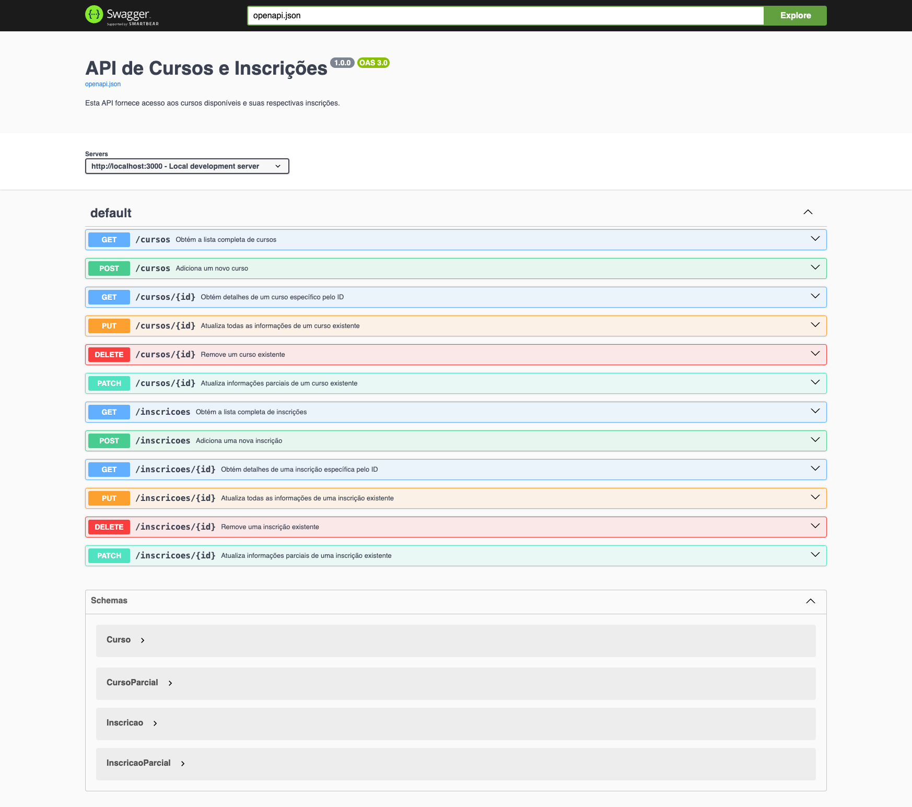
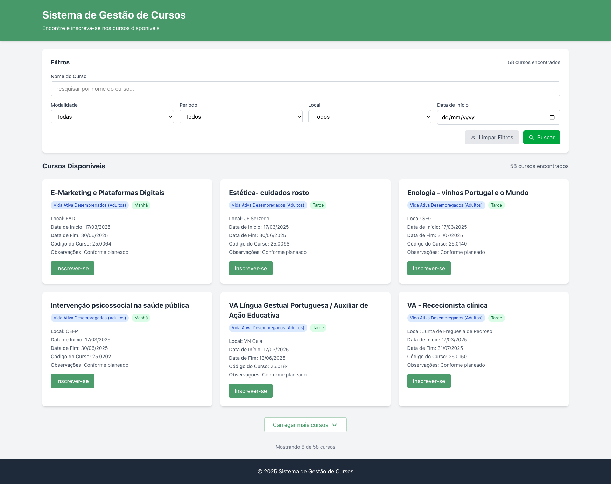
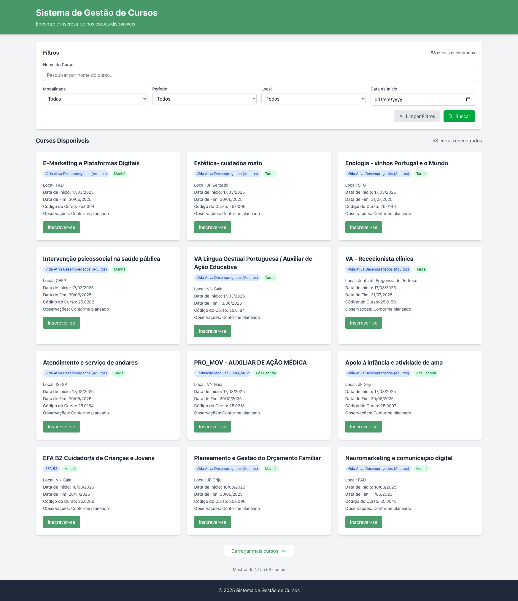
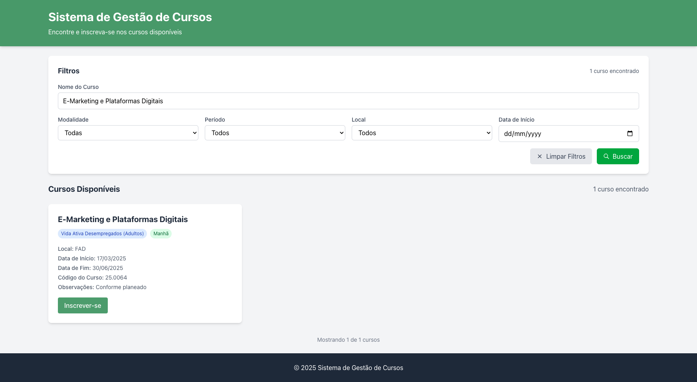
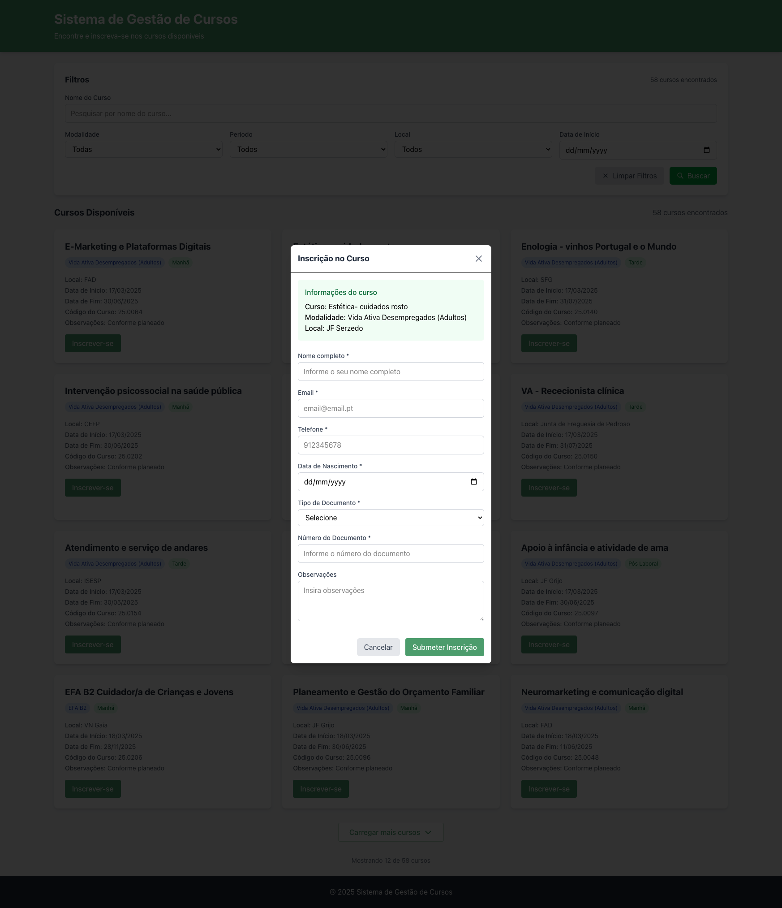

# 📚 Sistema de Gestão de Cursos

Bem-vindo ao **Sistema de Gestão de Cursos**! 🚀

Uma aplicação web desenvolvida em **React**, com **Vite** e **Tailwind CSS**, que permite visualizar, pesquisar e filtrar cursos disponíveis. Além disso, os usuários podem se inscrever diretamente nos cursos.

---

## ✨ Funcionalidades Principais

✅ **Lista de cursos** com paginação 🔄  
✅ **Filtragem** por modalidade, período, local e data de início 🔍  
✅ **Formulário de inscrição** com validação ✅  
✅ **Confirmação após inscrição bem-sucedida** 🎉  
✅ **Design responsivo** 📱💻  
✅ **API REST Mock** integrada 📡

---

## 🚀 Tecnologias Utilizadas

- **React** (com JSX)
- **Vite** ⚡
- **Tailwind CSS** 🎨
- **Fetch API** ou **Axios** para comunicação com a API
- **Hooks do React** (`useState`, `useEffect`)

---

## 📸 Capturas de Tela

| Página                         | Imagem                                                       |
| ------------------------------ | ------------------------------------------------------------ |
| 📜 **API Swagger**             |  |
| 🏠 **Página Inicial**          |            |
| ➕ **Carregar Mais**           |      |
| 🔍 **Filtragem**               |            |
| 📝 **Formulário de Inscrição** |   |

---

## 🛠️ Como Instalar e Rodar a Aplicação

### 🔧 Pré-requisitos

Antes de começar, certifique-se de ter instalado:

- [Node.js](https://nodejs.org/)
- [NPM](https://www.npmjs.com/) ou [Yarn](https://yarnpkg.com/)

### 📥 Instalação

1. Clone o repositório:

   ```bash
   git clone https://github.com/adelino-masioli/sistema-gestao-cursos.git
   cd sistema-gestao-cursos
   ```

2. Instale as dependências:
   ```bash
   npm install
   # ou
   yarn install
   ```

### ▶️ Rodando o projeto

1. Inicie a API Mock:

   ```bash
   npm start
   ```

2. Inicie a aplicação:

   ```bash
   npm run dev
   ```

3. Acesse no navegador:
   ```
   http://localhost:5173
   ```

---

## 📜 Estrutura do Projeto

📂 `src/` → Código-fonte da aplicação  
📂 `components/` → Componentes reutilizáveis  
📂 `pages/` → Páginas da aplicação  
📂 `public/screenshot/` → Capturas de tela  
📂 `api/` → Mock API

---

🔗 **Licença**: MIT 📜  
💻 **Desenvolvido por**: [Adelino Masioli](https://github.com/adelino-masioli)
